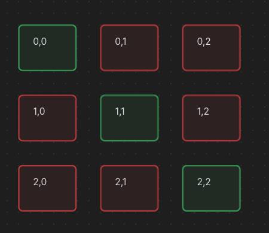
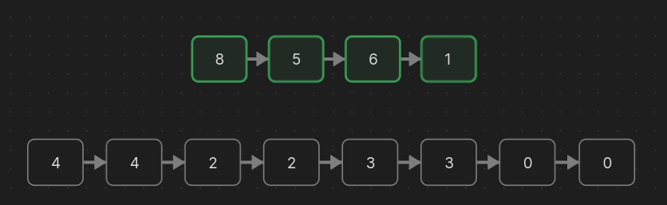
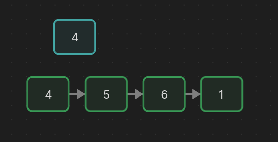
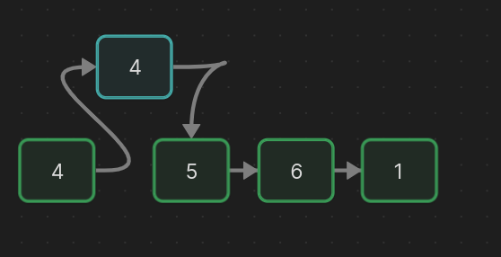
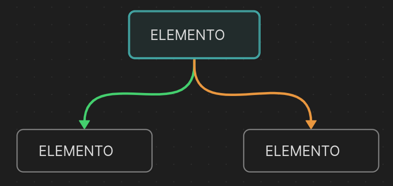
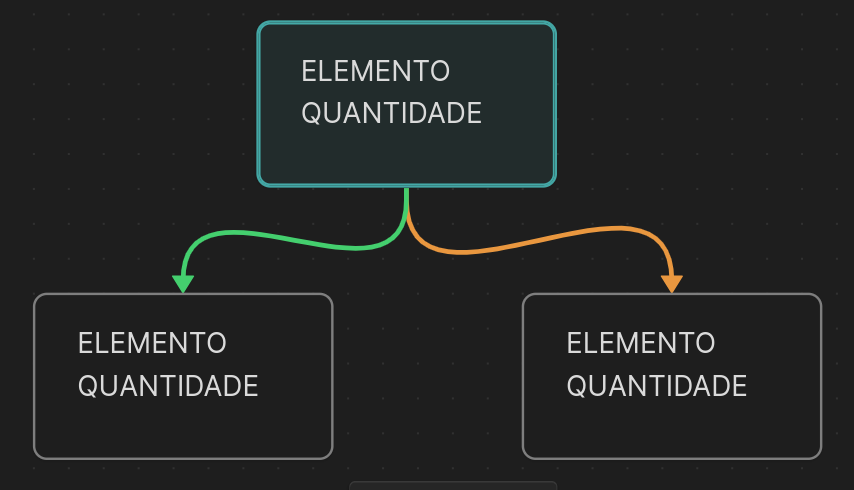
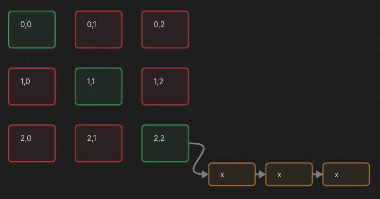
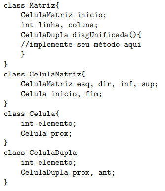

# Resolução Prova 02 - Algoritimo e Estrutura de Dados 02

## Questão 01 - Lista Simples em C

### Enunciado

*Dada uma lista simplesmente encadeada, implemente a função void meiose(). Esta função deve percorrer toda a lista, dividindo cada célula em duas, com cada nova célula contendo a metade do valor da célula original.
Abaixo, é apresentada a estrutura do código e uma ilustração que mostra a lista antes e após a operação. Apresente a complexidade do código em função de theta.*

### Interpretação

A questão referência a utilização de uma lista como maneira de criar e organizar uma estrutura de meiose. O conceito de `meiose` trata-se de uma repartição uma única célula em duas, nesse caso, o valor presente dentro de uma célula pai, como a exemplo, o valor `8`, se tornará `4` em duas células distintas (filhas). Segue o exemplo na imagem abaixo:



Nota-se que as duas células criadas deverão ser conectadas, para que assim a estrutura não perca sua sequencia como uma lista encadeada flexível. O exemplo abaixo demostra como funcionará de modo amplo essa meiose:



### Construção da Lógica

A construção do código pode ser realizada de diversos modos, podendo utilizar da lista já feita e adicionando novas células ou criando uma nova lista. O modo impletado abaixo utiliza da lista já existente, funcionando em 5 (cinco) etapas principais:

1. Estrutura de repetição que percorre as células da lista
2. Criação de uma nova célula
3. Definição dos valores da célula atual e nova por meio do valor presente na célula atual.
4. Redefinição dos ponteiros da célula atual e nova célula.
5. Definição da próxima célula atual.

#### Interpretação do código:

Em vez de criar uma nova lista utilizamos a lista já existente, utilizando de conceitos como `inserção em qualquer posição` já conhecidos em uma estrutura de lista. 

Primeiramente, iremos realizar estrutura de repetição que irá percorrer essa lista, assim, iremos definir qual a célula atual que estamos. 

Identificando a célula atual que estamos podemos criar uma nova célula por meio do método `malloc` da linguagem C. Essa nova célula irá receber em seu parametro `elemento` o valor do `elemento` da célula atual divido por dois. Desse modo, a célula atual fará o mesmo processo de atribuição de valores. 



Posteriormente, iremos redefinir os ponteiros. Esse processo se assemelha muito ao método de inserção em qualquer posição, visto que criará uma célula nova que receberá em seu parametro `prox` o mesmo valor da célula atual. Já a célula atual receberá em seu parametro `prox` a nova célula criada.



Por fim, temos que definir para aonde a célula atual irá apontar, que nesse caso, deverá ser duas posições posteriores visto que foi criado uma nova célula no meio. Assim, célula atual irá receber para aonde a nova célula aponta.

### Código

```C
void meiose() {
    Cel *atual = inicio;
    while(atual != null){
        Cel *novaCel = (Cel *)malloc(1 * sizeof(Cel));
        novaCel->elemento = atual->elemento/2; // Valor: nova célula
        atual->elemento = atual->elemento/2; // Valor: atual célula

        novaCelula->prox = atual->prox; // Ponteiro: nova célula
        atual->prox = novaCelula; // Ponteiro: atual célula

        atual = novaCelula->prox; // Localização: atual célula
    }
}
```

### Complexidade do Algorítimo 

Sua complexidade será `theta de n` visto que terá que percorrer todas as posições da lista para definir novos valores da meiose. 

Obs: importante ressaltar que seu valor é sempre `theta de n` pois, mesmo dobrando o valor da lista o valores percorridos pelo while continuam sendo somente a quantidade de `n`.

## Questão 02 - Árvore Binária de Busca em Java

### Enunciado 

*Considere a implementação de uma árvore binária de busca (BST) em que os nós armazenam números inteiros. Na BST vista em sala de aula, não eram aceitos elementos repetidos. Para este exercício, você
deve modificar a BST para que, ao inserir um número já existente, em vez de ignorar a inserção, a árvore armazene a quantidade de vezes que cada número foi inserido. Você deve implementar o método void inserir(int x). Você pode modificar os atributos da árvore. Apresente a complexidade do código em função de theta.*

### Interpretação

Em uma árvore binária, por padrão, evitamos de inserir valores iguais, para que assim métodos como inserção, pesquisa, remoção e dentre outros não tenham seu desempenho projudicado. 

Desse modo, esse exercício propoẽm uma forma de "driblar" essa problemática, fazendo com que, cada vez que seja identificado um elemento igual, tenha uma variável que possa armazernar quantas vezes esse elemento está repetido. 

### Contrução da Lógica

No estudo de árvores binárias temos uma sequência extremamente conhecida, que será detalhada abaixo:

- **raiz nula:** insere um novo nó na árvores
- **se não -> menor:** caminha para a esquerda
- **se não -> maior:** caminha para a direita
- **se não -> igual:** retorna falso, não insere ...

O último passo, que ocorre quando nenhuma resposta acima foi validada siginifica que encontramos uma valor no qual já existe dentro da nossa árvore binária. Por padrão a resposta seria falsa e o nosso método retornaria erro, mas é justamente isso que esse exercício evita.

Quando encotrado um valor igual, iremos realizar uma nova etapa, que nesse caso é inserir um contador que define quantas vezes esse valor está repetido. Entretanto, como esse contador será definido?

#### Construção da Lógica - Célula Nó Árvore

Cada nó da árvore apresenta três valores importantes, sendo eles, o `elemento` e dois ponteiros, uma para `esquerda` e um para a `direita`, como demonstrado na imagem abaixo:




Para a resolução do problema iremos criar um novo valor, sendo ele chamado `quantidade`. Desse modo, cada célula terá um valor que definirá a quantidade de vezes repetidas em que o valor presente no nó apareceu. Segue a imagem demostrada abaixo:



##### Construção da Lógica - Célula Nó Árvore - Código

```java
class No {
    public int el;
    public int qtd;
    public No esq, dir;

    public No(int el){
        this.el = el;
        this.qtd = 0; // Como não há elementos repetidos a princípio ele começa com o valor zerado
    }
}
```

#### Construção da Lógica - Método inserir

Como pedido pelo enunciado deve-se criar uma método com a seguinte assinatura:

```java
public void inserir(int x){...}
```

Esse método fará a chamada do nosso método recursivo de inserir, que irá receber dois parâmetros, como segue a assinatura do método abaixo:

```java
private void inserir(No no, int x){...}
```

O método acima segue uma estrutura muito semelhante a ordem anterior sobre inserção, pesquisa, remoção em árvores binárias. Ele irá seguir uma estrutura condicional até encontrar um elemento igual, se houver. Portanto, as três etapas iniciais do método seguem a mesma estrutura de um método de inserção padrão, entretanto, no momento que encontrar um elemento igual, ele fará um incremento no parametro do nó `qtd (quantidade)`.


##### Construção da Lógica - Método inserir - Código

```java
public void inserir(int x){
    inserir(raiz, x);
}

private void inserir(No no, int x){
    if(no == null){ // Se: null
        return new No(x);
    } else if(x < no.el){ // Se não: menor -> esquerda
        no.esq = inserir(no.esq, x);
    } else if(x > no.el){ // Se não: maior -> direita
        no.dir = inserir(no.dir, x);
    } else { // Se não: igual -> incremento
        no.qtd++;
    }
    return no;
}
```
### Complexidade do Algorítimo 

Como a alteração do código não traz efeitos diretos na pesquisa ou inserção de elementos o método mantém o mesmo custo de complexidade que o método de inserção padrão, sendo seus piores e melhores casos detalhados abaixo:

- **Melhor caso:** árvore balanceada aonde seu custo é `ϴ(log(n))`
- **Pior caso:** quando árvore não está balanceada ou seu valor esta na última posição `ϴ(n)`.

## Questão 03 - Matriz Flexível, Lista Simples e Dupla em Java

### Enunciado

*Considere a estrutura de classes abaixo, em Java, que representa uma matriz encadeada, onde cada célula da matriz (CelulaMatriz) contém uma lista de células (Celula). A classe Matriz possui um método diagUnificada que precisa ser implementado. Este método deve retornar um ponteiro para uma célula dupla (CelulaDupla) que
será o ínicio de uma lista duplamente encadeada contendo todas as células da diagonal principal da matriz (uma única lista duplamente encadeada resultado da concatenação de todas as listas da diagonal principal). Considere que as listas da Matriz possuem Célula Cabeça, que devem ser desconsideradas na lista resultante.*


### Interpretação 

Toda matriz quadrada (nXn) possuí uma diagonal principal que se refere aos elementos que se encontram posicionados com o mesmo índice de coluna e linha. Segue um exemplo da representação desse conceito:


O exercício proposto trabalha em cima desse conceito utilizando quatro pontos de estrutura de dados muito importantes, sendo eles:

1. Estruturas híbridas
2. Matriz flexível
3. Lista simples flexível
4. Lista dupla flexível

No exercício apresentado temos uma matriz flexível híbrida, na qual cada célula presente nela possuí a ligação com uma lista flexível simples. Assim, toda vez acesarmos uma célula dessa matriz, iremos ter a possíbilidade de acessar diversas outras células dessa vez da lista armazenada. Segue uma representação visual:



Entretanto, aonde o exercício deseja atingir?

### Contrução da Lógica

Até o momento trabalhamos com alguns conceitos importantes, sendo eles a diagonal principal e as estruturas de dados apresentadas na tarefa. O exercício pede nada menos do que, armazenar os valores presente na diagonal principal em uma nova estrutura de dados, que nesse caso será a `lista dupla`. 

Nesse caso, é importante ressaltar que: ao acessar cada célula da diagonal principal temos que também acessar a lista existente dentro dessa célula. Ou seja, nosso passo a passo seria:

1. Etapa que percorre a diagonal principal.
2. Etapa que acessa a lista simples presente dessa célula acessada anteriormente.
3. Etapa que armazena esse valor lido dessa lista simples em uma nova estrutura, que é a lista dupla.


### Interpretação do Código

O exercício pede claramente a construção de uma método chamado `diagUnificada`, que nesse caso fará a construção da tarefa exemplificada anteriormente. 

O próprio enunciado já oferece a construção das classes das estruturas de dados referenciadas. Seguem abaixo, uma imagem que demonstra essas estruturas que serão utilizadas para a construção do método:



Segue a listagem também, das estruturas que serão usadas:

- **Celula:** usada para construir a lista simples, que está presente dentro de cada célula da matriz. Ela armazena somente um valor e um apontamento para a próxima célula de referência.
- **CelulaDupla:** usada para construir a nossa nova estrutura de dados que é a `lista dupla`. Ela possuí dessa vez, três valores, sendo eles o `elemento` que armazena uma informação e dois apontadores: uma para a célula posterior e um para a célula anterior.
- **CelulaMatriz:** a célula matriz é uma outra etapa de construção de estruturas, ela é em si a mais complexa visto que armazena seis valores, sendo eles quatro (4) apontadores para uma outras células de matriz e dois (2) apontadores para armazer células simples da lista flexível simples.
- **Matriz:** responsável realmente por construir a nossa estrutura de matriz ele armazena três valores principais e é aonde iremos contruir o nosso método. Os valores armazenados são: um apontador para uma célula da matriz indicando o seu ínicio, e valores inteiros que representam sua quantidade linhas e colunas.


##### Construção da Lógica - Método digUnificada - Código

```java
CelulaDupla digUnificada() {
    if(inicio == null){ // Se o início está vazio é porque não  existe matriz inicializada
        return null;
    }

    CelulaMatriz sentinelaMatriz = inicio; // Percorre a matriz
    CelulaDupla inicioDupla = null; // Cria o início da lista dupla
    CelulaDupla fimDupla = null; // Cria o fim da lista dupla
    

    // Percorre a digonal principal da matriz
    while(sentinelaMatriz != null){

        // SE ATENTE AO `PROX` ele saí da célula cabeça da lista
        Celula sentinelaCelula = sentinelaMatriz.inicio.prox; // Pega o início da lista que será percorrida na célula identificada

        // Percorre a lista de cada célula
        while(sentinelaCelula != null){
            CelulaDupla novaCelula = new Celula(); // Cria uma célula da lista dupla
            novaCelula.elemento = sentinelaCelula.elemento; // Nova célula recebe seu valor
            fimDupla.prox = novaCelula; // Conecta as células
            novaCelula.ant = fimDupla; // Faz conexão com o ponteiro anterior
            fimDupla = novaCelula; // Altera o fim da lista dupla

            sentinelaCelula = sentinelaCelula.prox; // Aponta para o próximo valor
        }

        // Se a célula a direita for nula `sentinelaMatriz` será validada como nula e saíra do while externo
        // Se não for, `sentinelaMatriz` irá receber o valor da célula que está a direita inferior
        sentinelaMatriz = sentinelaMatriz.dir != null ? sentinelaMatriz.dir.inf : null;
    }
}
```

##### Informações importantes sobre o código

- A lista simples presente dentro de cada célula da matriz apresenta uma `célula cabeça` que é nada mais, do que uma célula que serve de orientação para o início da lista criada. Portanto a linha que refere `Celula sentinelaCelula = sentinelaMatriz.inicio.prox;` deve **NECESSÁRIAMENTE** ter o atributo de referência para o próximo, `prox` para que assim seja ignorado a célula cabeça.
- A lista dupla dessa vez não apresenta essa característica de ter uma célula cabeça, então não é necessário considerá-la. 

## Questão 04 - Verdadeiro ou Falso: justifique

### Questão 04 - Letra A

#### Enunciado 

*Não é possível desenhar uma árvore binária de busca tendo apenas o caminhamento em Pós-Ordem a seguir:*

*Pós-ordem: [4, 5, 6, 8, 7, 12, 18, 15, 10, 37, 42, 40, 55, 50, 20]*

#### Resposta

É possível construir uma árvore por meio do seu caminhamento em `pós-ordem` visto que esse caminhamento apresenta uma forma de construção e leitura dos dados.

O caminhamento `pós-ordem` faz a leitura da sub-árvore a esquerda, da sub-árvore a direita e por fim mostra a raiz, seguindo sempre esse mesmo padrão. Desse modo é possível encontrar padrões dessa estrutura.

- O último elemento será sempre a raiz


