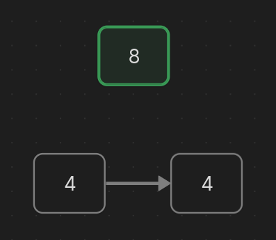
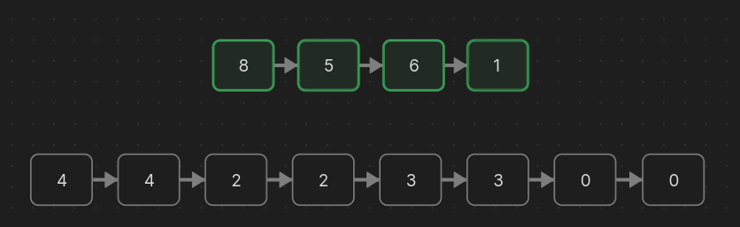
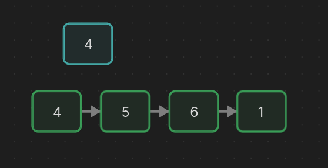
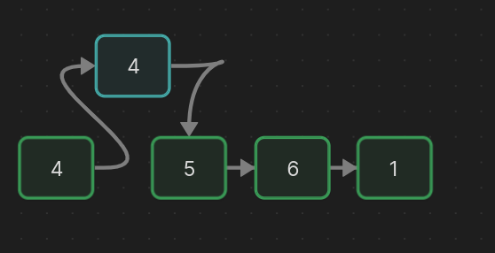
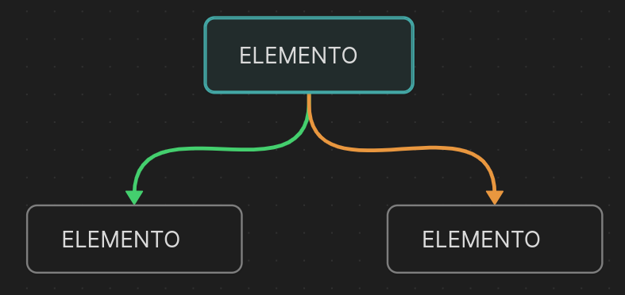
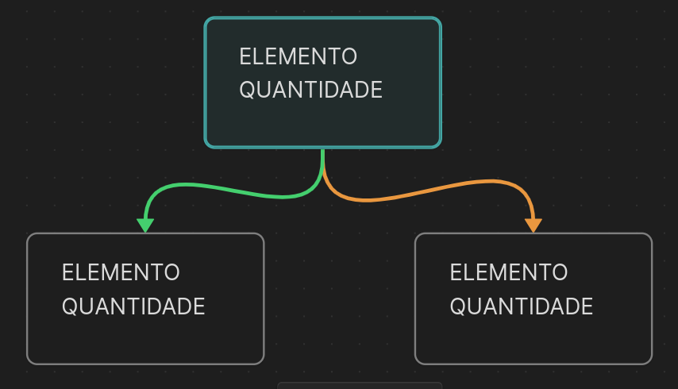

# Resolução Prova 02 - Algoritimo e Estrutura de Dados 02

## Questão 01 - Lista Simples em C

### Enunciado

*Dada uma lista simplesmente encadeada, implemente a função void meiose(). Esta função deve percorrer toda a lista, dividindo cada célula em duas, com cada nova célula contendo a metade do valor da célula original.
Abaixo, é apresentada a estrutura do código e uma ilustração que mostra a lista antes e após a operação. Apresente a complexidade do código em função de theta.*

### Interpretação

A questão referência a utilização de uma lista como maneira de criar e organizar uma estrutura de meiose. O conceito de `meiose` trata-se de uma repartição uma única célula em duas, nesse caso, o valor presente dentro de uma célula pai, como a exemplo, o valor `8`, se tornará `4` em duas células distintas (filhas). Segue o exemplo na imagem abaixo:



Nota-se que as duas células criadas deverão ser conectadas, para que assim a estrutura não perca sua sequencia como uma lista encadeada flexível. O exemplo abaixo demostra como funcionará de modo amplo essa meiose:



### Construção da Lógica

A construção do código pode ser realizada de diversos modos, podendo utilizar da lista já feita e adicionando novas células ou criando uma nova lista. O modo impletado abaixo utiliza da lista já existente, funcionando em 5 (cinco) etapas principais:

1. Estrutura de repetição que percorre as células da lista
2. Criação de uma nova célula
3. Definição dos valores da célula atual e nova por meio do valor presente na célula atual.
4. Redefinição dos ponteiros da célula atual e nova célula.
5. Definição da próxima célula atual.

#### Interpretação do código:

Em vez de criar uma nova lista utilizamos a lista já existente, utilizando de conceitos como `inserção em qualquer posição` já conhecidos em uma estrutura de lista. 

Primeiramente, iremos realizar estrutura de repetição que irá percorrer essa lista, assim, iremos definir qual a célula atual que estamos. 

Identificando a célula atual que estamos podemos criar uma nova célula por meio do método `malloc` da linguagem C. Essa nova célula irá receber em seu parametro `elemento` o valor do `elemento` da célula atual divido por dois. Desse modo, a célula atual fará o mesmo processo de atribuição de valores. 



Posteriormente, iremos redefinir os ponteiros. Esse processo se assemelha muito ao método de inserção em qualquer posição, visto que criará uma célula nova que receberá em seu parametro `prox` o mesmo valor da célula atual. Já a célula atual receberá em seu parametro `prox` a nova célula criada.



Por fim, temos que definir para aonde a célula atual irá apontar, que nesse caso, deverá ser duas posições posteriores visto que foi criado uma nova célula no meio. Assim, célula atual irá receber para aonde a nova célula aponta.

### Código

```C
void meiose() {
    Cel *atual = inicio;
    while(atual != null){
        Cel *novaCel = (Cel *)malloc(1 * sizeof(Cel));
        novaCel->elemento = atual->elemento/2; // Valor: nova célula
        atual->elemento = atual->elemento/2; // Valor: atual célula

        novaCelula->prox = atual->prox; // Ponteiro: nova célula
        atual->prox = novaCelula; // Ponteiro: atual célula

        atual = novaCelula->prox; // Localização: atual célula
    }
}
```

### Complexidade do Algorítimo 

Sua complexidade será `theta de n` visto que terá que percorrer todas as posições da lista para definir novos valores da meiose. 

Obs: importante ressaltar que seu valor é sempre `theta de n` pois, mesmo dobrando o valor da lista o valores percorridos pelo while continuam sendo somente a quantidade de `n`.

## Questão 02 - Árvore Binária de Busca em Java

### Enunciado 

*Considere a implementação de uma árvore binária de busca (BST) em que os nós armazenam números inteiros. Na BST vista em sala de aula, não eram aceitos elementos repetidos. Para este exercício, você
deve modificar a BST para que, ao inserir um número já existente, em vez de ignorar a inserção, a árvore armazene a quantidade de vezes que cada número foi inserido. Você deve implementar o método void inserir(int x). Você pode modificar os atributos da árvore. Apresente a complexidade do código em função de theta.*

### Interpretação

Em uma árvore binária, por padrão, evitamos de inserir valores iguais, para que assim métodos como inserção, pesquisa, remoção e dentre outros não tenham seu desempenho projudicado. 

Desse modo, esse exercício propoẽm uma forma de "driblar" essa problemática, fazendo com que, cada vez que seja identificado um elemento igual, tenha uma variável que possa armazernar quantas vezes esse elemento está repetido. 

### Contrução da Lógica

No estudo de árvores binárias temos uma sequência extremamente conhecida, que será detalhada abaixo:

- **raiz nula:** insere um novo nó na árvores
- **se não -> menor:** caminha para a esquerda
- **se não -> maior:** caminha para a direita
- **se não -> igual:** retorna falso, não insere ...

O último passo, que ocorre quando nenhuma resposta acima foi validada siginifica que encontramos uma valor no qual já existe dentro da nossa árvore binária. Por padrão a resposta seria falsa e o nosso método retornaria erro, mas é justamente isso que esse exercício evita.

Quando encotrado um valor igual, iremos realizar uma nova etapa, que nesse caso é inserir um contador que define quantas vezes esse valor está repetido. Entretanto, como esse contador será definido?

#### Construção da Lógica - Célula Nó Árvore

Cada nó da árvore apresenta três valores importantes, sendo eles, o `elemento` e dois ponteiros, uma para `esquerda` e um para a `direita`, como demonstrado na imagem abaixo:




Para a resolução do problema iremos criar um novo valor, sendo ele chamado `quantidade`. Desse modo, cada célula terá um valor que definirá a quantidade de vezes repetidas em que o valor presente no nó apareceu. Segue a imagem demostrada abaixo:



##### Construção da Lógica - Célula Nó Árvore - Código

```java
class No {
    public int el;
    public int qtd;
    public No esq, dir;

    public No(int el){
        this.el = el;
        this.qtd = 0; // Como não há elementos repetidos a princípio ele começa com o valor zerado
    }
}
```

#### Construção da Lógica - Método inserir

Como pedido pelo enunciado deve-se criar uma método com a seguinte assinatura:

```java
public void inserir(int x){...}
```

Esse método fará a chamada do nosso método recursivo de inserir, que irá receber dois parâmetros, como segue a assinatura do método abaixo:

```java
private void inserir(No no, int x){...}
```

O método acima segue uma estrutura muito semelhante a ordem anterior sobre inserção, pesquisa, remoção em árvores binárias. Ele irá seguir uma estrutura condicional até encontrar um elemento igual, se houver. Portanto, as três etapas iniciais do método seguem a mesma estrutura de um método de inserção padrão, entretanto, no momento que encontrar um elemento igual, ele fará um incremento no parametro do nó `qtd (quantidade)`.


##### Construção da Lógica - Método inserir - Código

```java
public void inserir(int x){
    inserir(raiz, x);
}

private void inserir(No no, int x){
    if(no == null){ // Se: null
        return new No(x);
    } else if(x < no.el){ // Se não: menor -> esquerda
        no.esq = inserir(no.esq, x);
    } else if(x > no.el){ // Se não: maior -> direita
        no.dir = inserir(no.dir, x);
    } else { // Se não: igual -> incremento
        no.qtd++;
    }
    return no;
}
```
### Complexidade do Algorítimo 

Como a alteração do código não traz efeitos diretos na pesquisa ou inserção de elementos o método mantém o mesmo custo de complexidade que o método de inserção padrão, sendo seus piores e melhores casos detalhados abaixo:

- **Melhor caso:** árvore balanceada aonde seu custo é `ϴ(log(n))`
- **Pior caso:** quando árvore não está balanceada ou seu valor esta na última posição `ϴ(n)`.

