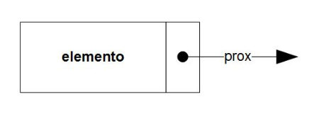
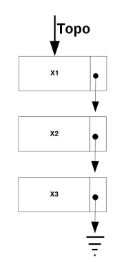
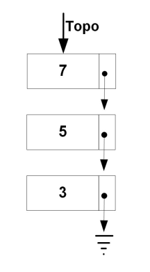
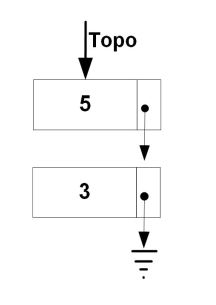

# Estrutura de Dados Flexível

As estruturas de dados são maneiras nas quais facilitam o acesso, controle e inserção dos dados. Podemos categorizá-las em dois grandes grupos, estruturas de dados lineares e flexíveis. A segunda forma se caracteriza por uma alocação de forma dinâmica, adaptando-se sem necessitar de um tamanho fixo pré definido 

## Estrutura de Dados Flexível

### Introdução - Célula

Pode-se dizer que a base para a realização e contrução de estrutura de dados flexíveis são as `células`. As células são uma parte das estruturas de dados que permite, por meio dela, inserir valores e sinalizações para para onde essa célula se encontra. Em palavra mais simples, são "caixinhas" que possuem duas ou mais repartições, sendo em menor nível e essêncial, uma com o valor do elemento, e uma com a posição para o pŕoximo elemento.




Agora, falando sobre valores definidos e mais objetivos no âmbito da computação, a célula apresenta um valor como tipo de dado geral e simples, como `int`, `string`, `bool` e outro valor que apresenta um ponteiro para outra céula que de maneira téorica deve referernciar algum outro elemento.

Como a estrutura de dados apresenta tipos, esse ponteiro será definido e apresentára valores de acordo com a estrutura de dados buscada a ser representada. Segue o código abaixo, feito em `Java` de como pode ser feita a construção dessa classe `Célula`:

```java
class Celula {
    public int elemento; // Valor a ser inserido
    public Celula prox; // Ponteiro para outra célula

    public Celula() { // Contrutor
        this(0);
    }

    public Celula (int x) { // Contrutor com parametros
        this.elemento = x;
        this.prox = null;
    }
}
```

### Pilha

A `pilha` é um estrutura de dados muito utilizada no âmbito de computação, e possui regras nas quais devem ser seguidas para obter a sua representação. Conhecida como, `First in, last out` ou `FILO`, sua principal regra é: que todos os elementos sejam inseridos e removidos pelo topo. Assim, para realizar a criação dessa estrutura de dados precisamos de outra referênciação, que nesse caso é o nosso `topo`. 



Portanto, ao criar uma estrutura de dados de formato pilha, precisamos usar a então já referênciada estrutura `Célula` como uma nova referência para `topo`, indicando como e onde funções de `deleção`, `inserção` e `amostragem` irão iniciar. Ou seja, pode se dizer que a célula se próprio refência refência. Logo abaixo segue a classe feita em `Java` de como é feita a criação da classe `pilha`: 


```java
class Pilha {
    private Celula topo; // Primeira célula sempre é a topo

    public Pilha () { // Construtor
        topo = null;
    }


    public void inserir(int x) { ... } // Inserção que recebe um parâmetro
    public int remover() { ... } // Remoção / Remove sempre no topo
    public void mostrar() { ... } // Amostragem / Mostra a partir do topo
}
```

#### Pilha - Inserção

Quando falamos de estruturas de dados, seja ela estática ou flexível, temos que nos atentar a métodos como remoção e inserção, então, por meio desse tópico iremos detalhar um pouco mais sobre o método de `inserção`.

Sendo um código bem simples, o método de `inserção` deve se atentar a uma questão principal, sendo ela, a organização e refênciação ao topo. O passo a passo está detalhado abaixo:

1. Cria uma nova céula que possui o elemento passado por parâmetro do método. (Ele aponta para `null`)
2. Essa nova célula irá apontar para para o a célula definida como `topo`.
3. A primeira célula definida, `topo`, irá receber a nova célula definida.
4. O poteiro que etava alocado para essa nova célula criada se tornará agora nulo.

Segue o código e a foto definição final dessa estrutua:

```java
public void inserir(int x) { //Inserir(5)
    Celula tmp = new Celula(x);
    tmp.prox = topo;
    topo = tmp;
    tmp = null;
}
```


#### Pilha - Remoção

O método `inserção` e `remoção` funcionam de modo muito similar, sendo esses, basicamento o controle da refência `topo`. Seus passos a passos estão definidos logo abaixo: 


1. Verifica-se o topo é diferente de nulo, pois toda operação depende dele.
2. Cria uma variável do tipo do elemento para ser retornada
3. Cria uma célula temporária para realizar o controle de `topo`
4. Muda a refência do topo para a próxima posição
5. Coloca a célula tempoŕaria e seu ponteiro interno `próximo` como `null`.
6. Retorna o elemento

Logo abaixo segue tanto o código como a foto do processo inicial e final de deleção:





```java
public int remover() throws Exception {
    if (topo == null) 
        throw new Exception('Erro!');
    int elemento = topo.elemento;
    Celula tmp = topo;
    topo = topo.prox;
    tmp.prox = null;
    tmp = null;
    return elemento;
}
```
#### Pilha - Mostrar

O método de mostrar depende essencialmente da refência de todo, e segue posteriormente uma forma padrão de mostragem de dados, a partir de um `for`. Abaixo, segue o passo a passo desse método:

1. Possui um `for` que inicia seu `index` por meio da célula topo
2. Esse `for` vai até que i segue diferente de null
3. O `for` irá caminhar o index para a refência `próximo` desse mesmo index: `i = i.prox`

Logo abaixo, temos o código desse método:

```java
public void mostrar() {
    System.out.print('[ ');
    for (Celula i = topo; i != null; i = i.prox){
        System.out.print(i.elemento + '');
    }
    System.out.println(']');
}
```

### Fila

Possui uma classe dessa vez com dois ponteiros, um para a primeira e outro para a última posição. Primeiro é no cabeça, não tem valor válido

Inserir - altera o último de posição
Remover - altera o primeiro de posição

Inserir: 

ultimo.prox recebe uma nova célula com o valor passado por parâmetro
referencia o último como a nova célula criada

Remoção:

verifica se primeiro e ultimo não são iguais
Cria celula temporária que referencia o primeiro
o primeiro será o próximo
salva o valor do elemento deletado que é o priemiro.prox pq o primeiro primeiro é no cabeça
coloca tmp como null
retonrna elemento
